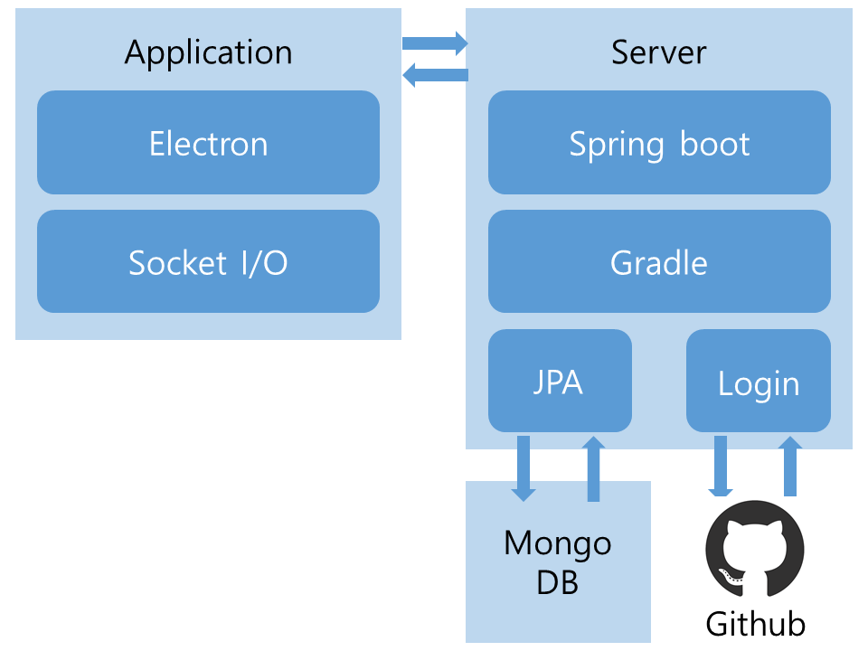

  

**Sparkling** is a tool that allows the macOS missing package manager, [homebrew](http://brew.sh/), to be used in a GUI environment.  

## Features  
***  

* Sparkling can easily manage the macOS package. Much easier than Homebrew.  
* Sparkling can get its preferences to another mac PC.  
* Sparkling can also evolve into package managers in other CUI environments (eg, npm, yum).  

## Architecture  
***

  

## Usage  
***

In terminal  

```
git clone https://github.com/sauber92/Sparkling.git  
cd app  
npm install  
npm start
```

## License  
***

**Sparkling** is released under [MIT License](LICENSE)